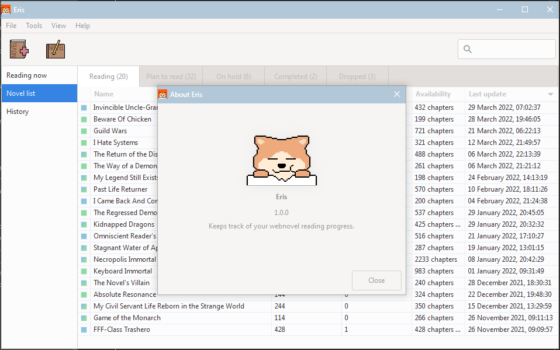

# Eris
Eris is an open-source desktop application for keeping track of your webnovel reading progress.
It tries to automatically detect which webnovel you're reading on your computer and 
keep track of the chapters read.

Eris is written in rust and uses GTK 3 for the GUI.



Heavy visual inspiration from [taiga](https://github.com/erengy/taiga) anime tracker.


## Features
### Adding webnovels to Eris
Webnovels can be added from a few sources:
- [https://www.novelupdates.com](https://www.novelupdates.com)
- [https://www.royalroad.com](https://www.royalroad.com)
- [https://www.scribblehub.com](https://www.scribblehub.com)
- [https://www.webnovel.com](https://www.webnovel.com/)
- epub file

Additionally the novel database can be exported to JSON and imported from JSON.

### Webnovel recognition
Eris looks for certain keywords (changeable in settings) in any window titles and then
guess what webnovel might be being read. Each novel can have novel specific keywords for recognition.

Any recognized webnovel will have its "chapters read" amount changed after 120 seconds (changeable in settings).

The recognition system can be toggled on and off.

### Portability
By default Eris saves the data into the OS's [data directory](https://docs.rs/dirs/4.0.0/dirs/fn.data_dir.html). It is possible to use Eris as portable application though.

#### Windows
Creating a directory named `data` in the Eris root directory.

#### Linux
For linux the `data` directory has to be in the same location as the binary file.

#### MacOS
_Might_ work the same as linux.


### Continue reading
If the novel chapter URL is easily mutable, e.g: `https://example.com/novelname/chapter-1`
then Eris can open the next chapter on your default browser. Assuming the reading URL is set in the novel settings.

There is also an option for Eris to open a file with any third party software with arguments
(filename, page number).

### History
A simple history to know when you started your thousand chapter journey.


## Installation
There are precompiled binaries available for Windows, Linux and macOS and they can be found [**here**](https://github.com/Temeez/eris/releases/).

### Windows
Extract the .zip package for Windows and you are done.

### Linux
Required packages:
- `gtk3` (min. version 3.24)

Running the binary file should work after the required package(s) are installed.

### MacOS
Good luck.

`osascript` is required for novel recognition.

### Other
Good luck. This is my last one so I am all out now.


## Compilation
Somehow setup a GTK 3 development environment for your OS.

### Windows
Follow this [guide](https://gtk-rs.org/gtk4-rs/stable/latest/book/installation_windows.html#gnu-toolchain) ([backup link](https://web.archive.org/web/20211114081841/https://gtk-rs.org/gtk4-rs/stable/latest/book/installation_windows.html#gnu-toolchain)) but type gtk3 instead of gtk4 and that _should_ be it.

### Linux
Follow this [guide](https://gtk-rs.org/gtk4-rs/stable/latest/book/installation_linux.html#host) ([backup link](https://web.archive.org/web/20220101103845/https://gtk-rs.org/gtk4-rs/stable/latest/book/installation_linux.html#host)) but type gtk3 instead of gtk4.

### MacOS
Good luck. I loaned this one so do not lose it!


## Translators
Translators are welcome to submit translations directly as a pull request to this project. It is generally expected that your pull requests will contain a single commit for each language that was added or improved, using a syntax like so:

```
i18n(eo): Add Esperanto language support
```

```
i18n(pl): Improvements to Polish language support
```

Translation files can be found [here](./i18n/). Eris uses [Project Fluent](https://projectfluent.org) for the translations, which should be easier than working with gettext.

### Adding new translation
Just copy any available languge directory in `/i18n/` and rename it.
Then start editing the eris.ftl file inside.

### Testing
Testing new translation locally requires the ability to compile Eris.
After successfully compiling Eris with the new translation it can be selected in the app settings.

There is also a [test_fluent.py](https://raw.githubusercontent.com/Temeez/scripts/main/python3/test_fluent.py) python 3 script which can be useful. 

### Supported Languages
- [English](./i18n/en/)


## License
Code is distributed under MIT license.

The program is completely free to use.